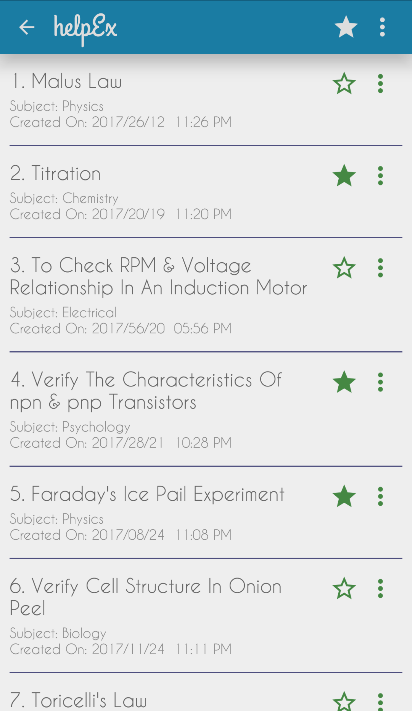

## helpEx for Android

  

This project is an Android application for assisting students in recording their Experimental Data, usually for _Academic purposes_.

The functionalities in the app are:
1. Record data for experiments - SQLite.
2. Parsing equations from String expressions.
3. Generate multiple Graphs.
4. Export Graphs as JPG file.
5. Export data in different formats - pdfs, excel, etc.
6. Zoom in or Zoom out the table.
7. Dynamically add/remove columns.
